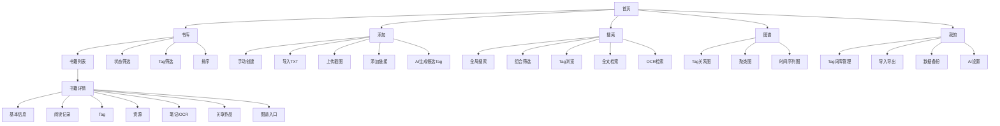
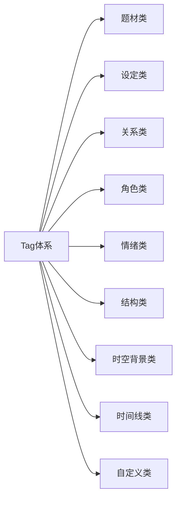

# 私人小说档案 App MVP 产品文档

版本：`v0.1`

日期：`2026-03-30`

作者：`Serena`

## 1. 产品概述

### 1.1 产品定位

`私人小说档案` 是一款面向小说重度读者的私有化阅读档案 App，用于统一管理“我看过什么、喜欢什么、资源在哪里、为什么喜欢、如何重温”，并通过 `Tag`、全文检索、OCR、AI 辅助分析和图谱可视化，建立个人阅读知识库。

### 1.2 产品愿景

帮助用户把分散在 `TXT / 截图 / 链接 / 本地文件 / 网盘备注 / 手动输入` 中的小说内容与阅读记忆沉淀成一个长期可维护、可检索、可回顾、可视化的私人书库。

### 1.3 核心价值

- 统一归档分散的小说资源
- 统一记录阅读状态、进度、印象、评分和笔记
- 用 `Tag` 结构化管理阅读经验
- 支持重温时快速定位资源
- 把看过的书沉淀为个人阅读图谱

## 2. 目标用户

### 2.1 主要用户

- 网文/小说重度阅读者
- 多平台、多来源阅读的用户
- 经常保存截图、TXT、片段和收藏链接的用户
- 会反复重温作品、希望整理偏好的用户

### 2.2 典型用户特征

- 看过很多书，但记不清书名、作者和资源来源
- 同一本书可能有多个版本或多个保存位置
- 有大量截图、TXT、笔记和零散记录
- 喜欢用题材、设定、角色关系、情绪风格等维度区分作品
- 愿意花少量时间维护自己的私人书库

## 3. 核心问题

- 书看过但忘了
- 喜欢的点记不住
- 想重温时找不到资源
- 资源分散且版本混乱
- 截图和 TXT 无法统一检索
- 很难系统性总结自己的阅读偏好
- 无法把读过的书组织成整体图谱

## 4. 产品目标

### 4.1 MVP 目标

第一阶段完成以下 4 件事：

- 建立 `一书一档案`
- 建立 `Tag 驱动的检索体系`
- 建立 `资源归档 + OCR + 全文检索`
- 生成 `基础阅读图谱`

### 4.2 非 MVP 范围

以下内容不纳入第一阶段：

- 内容抓取平台
- 公共社区
- 在线分发或共享盗版资源
- 复杂推荐算法
- 自动解析完整剧情时间线
- 多人协作书库

## 5. 产品原则

- `本地优先`：优先保证资源可控、可离线访问
- `记录先于阅读`：优先把管理能力做好，再提升阅读器体验
- `一书一档案`：每本书统一挂载进度、资源、截图、笔记和评价
- `来源可追溯`：每条资源都记录来源和有效状态
- `AI 只做建议`：AI 负责生成候选信息，最终由用户确认
- `合规边界清晰`：支持个人导入和私有管理，不做侵权分发

## 6. 核心功能需求

### 6.1 书籍档案

每本书建立统一档案页，字段建议如下：

- 书名
- 别名
- 作者
- 简介
- 角色名（top4）
- 状态：`想读 / 在读 / 读完 / 弃读 / 重温中`
- 阅读进度：章节、百分比、备注
- 评分
- 一句话印象
- 长评
- 阅读时间线：开始时间、结束时间、重温时间（可显示所有历史时间）
- 资源列表
- Tag 列表
- 笔记 / 截图 / OCR 内容
- 关联作品

### 6.2 资源管理

支持挂载多个资源：

- `TXT`
- `截图`
- `外部链接`
- `网盘备注`
- `来源说明`

每条资源建议包含：

- 资源类型
- 来源渠道
- 文件名或备注
- 是否有效
- 上传/录入时间

### 6.3 阅读记录

支持记录：

- 当前阅读状态
- 当前章节/百分比
- 上次阅读时间
- 首次阅读时间
- 完成时间
- 重温次数
- 阅读备注

### 6.4 Tag 系统

`Tag` 是产品核心能力之一。

#### 6.4.1 Tag 分类建议

- `题材类`：玄幻、无限流、校园、星际、末世、都市、官场、异界、灵异、悬疑、治愈系、同人、职场、娱乐圈、历史、官配、耽美官场
- `设定类`：穿书、系统、重生、ABO、哨向、师徒、双洁、前世今生、灵魂互换、替身、合约、复仇、逃婚、快穿、时间循环、空间流、反派重生、变身、修罗场
- `关系类`：年上、年下、双强、宿敌、救赎、互相养成、互相攻略、甜宠、虐恋、忠犬、腹黑、1v1、1v多、np、ntr、先虐后甜、先甜后虐、青梅竹马、暗恋、师徒、兄弟
- `角色类`：主攻、主受、攻受互换、换攻、换受、双C、强攻、强受、清冷、温柔、腹黑、疯批、禁欲、事业脑、毒舌、绅士、外冷内热、傲娇、病娇、软攻、硬受、师尊、师父、玉面、皇子、总裁、医生、教授、军人、演员、明星、歌手、律师、警察、特工、作家、画师、游戏玩家
- `情绪类`：酸涩、甜宠、压抑、治愈、高燃、虐心、爽文、慢热、沙雕、暗恋、撒糖、绝望、温馨、燃血、反转、沉重、轻松、疗愈、悬疑
- `结构类`：群像、单元剧、慢热、破镜重圆、先婚后爱、伪装恋人、双主线、多POV、番外、平行线、回忆线、并行叙事、实验文
- `时空背景类`：古代、现代、民国、未来、架空、平行世界、穿梭、次元、异界、都市、架空历史、近未来
- `时间线类`：少年期、成年期、中年期、前世今生、童年回忆、青春期、余生、后日谈、旧爱回归、年轮、学霸期
- `自定义类`：用户自定义（支持自定义Tag、自动推荐Tag、Tag别名、合并、分级权重）

#### 6.4.2 Tag 来源

- 用户手动输入
- 网页检索结果提取
- AI 根据书名、简介、用户笔记、TXT、OCR 内容生成候选 Tag
- 从已有 Tag 词库中推荐

#### 6.4.3 Tag 功能要求

- 一本书可绑定多个 Tag
- 支持 `主 Tag / 次 Tag`
- Tag 支持别名
- Tag 支持人工确认、删除、合并
- Tag 支持分类筛选
- 支持按 Tag 统计数量和频次
- 支持按 Tag 进行聚类和图谱展示

#### 6.4.4 MVP 原则

- AI 生成的 Tag 默认标记为 `候选`
- 用户确认后才进入正式标签体系
- 保留 Tag 来源和置信度，便于后续优化

### 6.5 OCR 与文本入库

支持：

- 上传截图
- OCR 提取文本
- OCR 文本挂到书籍档案下
- OCR 文本可搜索
- 用户手工修正 OCR 结果

TXT 支持：

- 上传 TXT
- 存储原文
- 支持全文检索
- 支持定位到章节或段落
- 从 TXT 中提取候选 Tag 和高频词

### 6.6 检索系统

检索范围：

- 书名
- 别名
- 作者
- 角色名
- Tag
- 一句话印象
- 长评
- OCR 文本
- TXT 全文
- 资源备注

检索方式：

- 全局搜索
- Tag 筛选
- 多条件组合筛选
- 最近阅读
- 最近添加
- 高评分
- 重温次数

### 6.7 图谱可视化

MVP 推荐做 3 种视图：

#### 6.7.1 Tag 关系图

- 节点：书、Tag
- 边：书与 Tag 的归属关系
- 目标：快速看到阅读偏好的中心结构

#### 6.7.2 聚类图

- 按某个 Tag 维度聚类
- 示例：`年上 / 年下 / 双强 / 救赎`
- 示例：`现代 / 古代 / 星际 / 末世`

#### 6.7.3 时间序列图

不做复杂剧情自动解析，先按结构化 Tag 组织。

可支持以下序列方式：

- 按故事背景时代：`古代 -> 民国 -> 现代 -> 未来`
- 按角色阶段：`少年期 -> 成年期 -> 中年期`
- 按设定时间：`前世 -> 今生`

MVP 规则：

- 由用户手动标注或 AI 建议时间类 Tag
- 序列图基于已确认 Tag 排序生成

#### 6.7.4 基于 Tag + 图谱的阅读推荐

推荐目标：

- 通过用户已确认 Tag 和阅读记录，生成“同类型推荐”和“同作者推荐”。
- 在书籍详情、Tag关系/聚类/时间线图中实时展示推荐书单。
- 推荐结果需带“推荐理由（:: 同Tag重合率 / 同作者 / 图谱邻居）”。

推荐逻辑：

1. 读取当前书籍 `book_id` 的确认Tag，输出 `tag_set`
2. 候选池：未读书（或当前读取状态非弃读）
3. 计算相似度：
   - `score_tag = shared_tags / union_tags`
   - `score_author = 1.0`（同作者）
   - `score_graph = （同簇/邻居）0.4`（若属于同图谱聚类）
   - 最终 `score = 0.6*score_tag + 0.3*score_author + 0.1*score_graph`
4. 过滤与排序：支持设置 `min_score`、`read_state`、`tag_blacklist`
5. 返回 topN（如 8）结果，并带说明字段

推荐卡片字段：

- 书名、作者、封面、当前状态
- 相似度得分、重合 Tag（例：`师徒、1v1、甜宠`）
- 来源（`tag`/`author`/`graph`）

#### 6.7.5 推荐模块 API 规范（示例）

- 接口：`GET /api/recommend/books` 
- 参数：
  - `book_id`: 当前文章 ID
  - `user_id`: 当前用户 ID
  - `top_n`: 推荐数量（默认 8）
  - `include_read`: 是否包含已读（默认 false）
  - `min_score`: 最低相似度阈值（默认 0.3）

- 响应：
```json
{
  "code": 0,
  "data": [
    {
      "book_id": 1024,
      "title": "冰川师徒",
      "author": "浮生若梦",
      "score": 0.84,
      "matched_tags": ["师徒","年上","1v1"],
      "source": ["tag","author"],
      "reason": "同作者+Tag 3/5重合"
    }
  ]
}
```

- 可选：`POST /api/recommend/feedback`
  - body: `{ "user_id": 123, "book_id": 1024, "action": "like"/"dislike" }`
  - 存储 `BookRecommendationFeedback(user_id, book_id, action, created_at)`

## 7. AI 功能边界

MVP 中 AI 只做以下 3 类辅助：

- 根据简介/TXT/OCR 提取候选 Tag
- 生成作品印象总结草稿
- 识别潜在重复书籍

MVP 暂不做：

- 自动解析完整剧情时间线
- 自动生成人物关系图
- 自动推荐下一本最适合的小说

## 8. 核心用户流程

### 8.1 流程 A：新增一本书

1. 用户输入书名或手动创建
2. 补充作者、简介、状态
3. 上传 TXT / 截图 / 链接
4. OCR 或文本解析
5. AI 生成候选 Tag
6. 用户确认 Tag
7. 建立档案完成

### 8.2 流程 B：重温一本书

1. 搜索书名或 Tag
2. 进入档案页
3. 查看上次阅读时间、进度、印象
4. 打开对应资源
5. 继续阅读并更新记录

### 8.3 流程 C：找某类小说

1. 进入 Tag 浏览页
2. 选择多个 Tag 条件
3. 查看符合条件的作品
4. 进入图谱或列表进一步筛选

### 8.4 流程 D：做偏好回顾

1. 进入图谱页
2. 按关系/题材/时间背景聚类
3. 查看高频 Tag 和关联书籍
4. 总结个人阅读偏好

## 9. 页面结构与信息架构

### 9.1 一级导航

- 首页
- 书库页
- 搜索页
- 添加页
- 图谱页
- 我的页

### 9.2 页面说明

#### 首页

- 最近阅读
- 最近添加
- 最近重温
- 高频 Tag
- 快速新增入口

#### 书库页

- 列表/卡片视图
- 状态筛选
- Tag 筛选
- 排序：最近阅读、评分、添加时间

#### 书籍详情页

- 基本信息
- 阅读记录
- Tag
- 资源
- 笔记/OCR
- 关联作品
- 图谱入口

#### 搜索页

- 全局搜索框
- 热门 Tag
- 历史搜索
- 组合筛选
- 全文检索
- OCR 检索

#### 添加页

- 手动创建
- 导入 TXT
- 上传截图
- 添加链接
- AI 生成候选信息

#### 图谱页

- Tag 关系图
- 聚类图
- 时间序列图

#### 我的页

- Tag 词库管理
- 导入导出
- 数据备份
- AI 设置

### 9.3 信息架构草图



### 9.4 Tag 结构草图



## 10. 数据模型草案

### 10.1 Book

- id
- title
- alias
- author
- intro
- status
- rating
- short_review
- long_review
- created_at
- updated_at
- last_read_at

### 10.2 Resource

- id
- book_id
- type
- path_or_url
- source
- version_label
- is_available
- note

### 10.3 ReadingSession

- id
- book_id
- start_at
- end_at
- progress_value
- progress_unit
- note

### 10.4 Tag

- id
- name
- category
- alias
- description

### 10.5 BookTag

- id
- book_id
- tag_id
- source：`manual / ai / imported`
- confidence
- is_confirmed
- weight

### 10.6 Note

- id
- book_id
- type：`text / image / ocr`
- content
- source_resource_id

### 10.7 GraphViewConfig

- id
- user_id
- type
- filter_rules
- layout_mode

### 10.8 Recommendation

- id
- user_id
- base_book_id
- recommended_book_id
- score
- reason
- source_tags
- source_author
- created_at

### 10.9 BookTag

- id
- book_id
- tag_id
- source: `manual / ai / imported`
- confidence
- is_confirmed
- weight

### 10.10 AuthorBook

- id
- author_id
- book_id

### 10.11 RecommendationFeedback

- id
- user_id
- recommended_book_id
- action: `like / dislike` 
- created_at

## 11. 竞品分析表

以下为截至 `2026-03-30` 的公开信息整理，重点对比“阅读记录、资源归档、Tag、OCR、图谱”能力。

| 产品 | 类型 | 本地TXT/文件 | 阅读记录 | Tag体系 | OCR截图 | 图谱可视化 | 适合参考点 | 不足 |
|---|---|---:|---:|---:|---:|---:|---|---|
| 微信读书 | 内容平台 | 弱 | 强 | 弱 | 弱 | 无 | 阅读体验、笔记、书架 | 平台封闭，不能管理分散资源 |
| 起点读书 | 网文平台 | 弱 | 中 | 弱 | 弱 | 无 | 网文场景、书架、进度 | 不适合个人私有书库 |
| Koodo Reader | 本地阅读器 | 强 | 中 | 弱 | 弱 | 无 | 本地文件管理、跨平台阅读 | 更像阅读器，不像阅读档案 |
| Moon+ Reader | 本地阅读器 | 强 | 中 | 弱 | 弱 | 无 | TXT 阅读能力 | 知识化管理能力不足 |
| Openreads | 读书记录 | 弱 | 强 | 中 | 弱 | 弱 | 阅读状态、统计、标签 | 不偏小说资源归档 |
| Bookmory | 阅读记录 | 弱 | 强 | 中 | 弱 | 弱 | 记录、统计、打卡 | 文件归档弱 |
| calibre | 私有书库 | 强 | 中 | 中 | 弱 | 无 | 元数据、文件库、内容服务器 | 偏电子书管理，不偏小说档案 |
| Kavita | 私有书库 | 强 | 中 | 中 | 弱 | 无 | 自建书库、阅读进度、元数据 | 小说偏好图谱不足 |
| BookLore | 私有书库 | 强 | 中 | 中 | 弱 | 弱 | 自建库、书架、元数据 | 不是以 Tag 图谱为核心 |

### 11.1 竞品结论

目前主流产品大多集中在以下两类能力：

- `阅读器能力`
- `阅读记录能力`

你的产品差异化应明确为：

`面向小说爱好者的私人阅读档案系统，重点解决资源归档、Tag 结构化、重温检索和阅读图谱。`

## 12. 版本规划建议

### 12.1 V0.1

- 书籍档案
- TXT/截图导入
- OCR
- Tag 手动管理
- 基础搜索

### 12.2 V0.2

- AI 候选 Tag
- Tag 合并/别名
- 全文检索优化
- 基础图谱页

### 12.3 V0.3

- 聚类视图
- 时间序列视图
- 偏好统计
- 重复书籍识别

## 13. 成功指标

MVP 建议关注以下指标：

- 单本书平均录入时间小于 3 分钟
- 80% 的书可完成至少 3 个有效 Tag
- 用户可在 10 秒内定位已归档资源
- OCR/TXT 检索具备可用命中率
- 图谱页可稳定展示主要偏好聚类

## 14. 下一步建议

建议后续继续输出以下文档：

1. `V0.1 功能清单 + 页面原型说明`
2. `技术方案草案（前端/后端/数据库/AI/OCR/图谱）`
3. `Tag 词库设计文档`
4. `数据库表结构草案`

